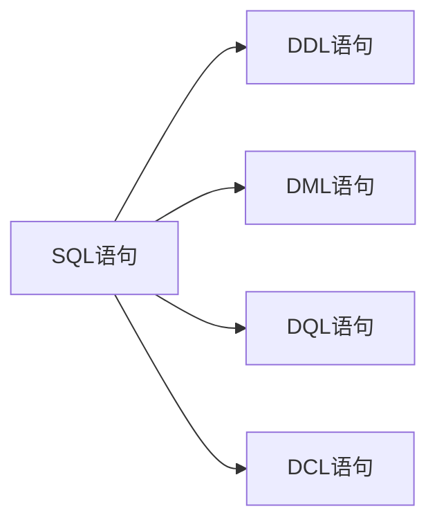
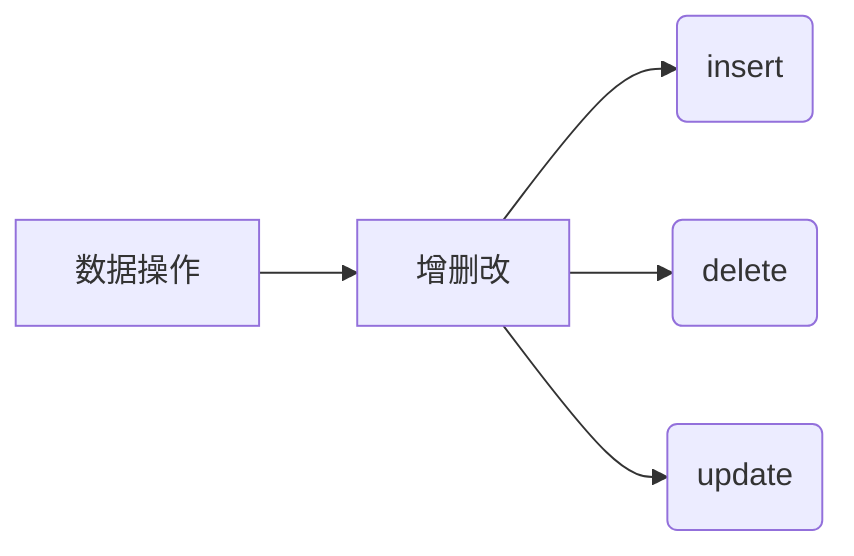

# MySQL学习

## 数据库定义与类型；

## 数据库通用语法


## DDL语句

#### 数据库操作
* 创建数据库：create database 数据库名;
    ```SQL
    create database [if not exists] 数据库名 [default   character set 字符集] [default collate 排序规则];
    ```
* 查询数据库：show databases;
    ```SQL
    show databases;
    ```
* 删除数据库：drop database 数据库名;
    ```SQL  
    drop database [if exists] 数据库名;
    ```
* 查询当前数据库：show database();
* 使用数据库：use 数据库名;
---
#### 表操作

* 查询操作
  * 查询所有表：show tables;
  
    
  * 查询表结构：desc (tableName);
  

  * 查询建表语句：show create table 表名;
<br>

* 创建操作
    * 创建表：
  ``` SQL
  create table 表名(字段列表 字段类型 [约束] [,字段名 字段类型 [约束]]...);
  ```
  * 字段类型：
 ```mermaid
 graph TD
   字段类型--> 数值型
   字段类型--> 字符型
   字段类型--> 时间型
   字段类型--> 布尔型 
   数值型--> int
   数值型--> float
   数值型--> double
   字符型--> char
   字符型--> varchar
   时间型--> date
   时间型--> time
   时间型--> datetime
   布尔型--> boolean
 ``` 
<br>  

* 修改操作
    * 修改表名：alter table 表名 rename to 新表名;
    * 删除表： drop table 表名;
    * 修改字段：
        ```sql
        alter table 表名 modify column 字段名 新字段类型;
        alter table 表名 change column 字段名 新字段名 新字段类型;
        ```
        
* 删除操作
  
    ``` SQL
    -- 直接删除
    drop table 表名;

    -- 清空表/删除再建一个新表
    truncate table 表名;

    -- 删除字段
    alter table 表名 drop [column] 字段名;
    ```
## DML语句

### 数据操作——增删改

#### 1.insert语句
``` SQL
insert into 表名(字段1,字段2,字段3) values(值1,值2,值3);
insert into 表名 values(值1,值2,值3);
```
_插入数据时，如果字段名省略，则必须使用values关键字，否则必须使用字段名。
数据要一一对,
数据范围也要注意:_
1. _字段类型：字符和日期要引号_
2. _字段值范围：不能超过int范围_

#### 2.update语句
``` SQL
update 表名 set 字段1=值1,字段2=值2,字段3=值3 where 条件;
update 表名 set 字段1=值1,字段2=值2,字段3=值3;
```
#### 3.delete语句
``` SQL
delete from 表名 where 删除条件;
delete from 表名;
```
## DQL语句——查询语句
1. 基本查询(select)：
``` SQL
--- 查询所有字段
select * from 表名 as 别名;

--- 查询指定字段
select 字段1,字段2,字段3 from 表名 as 别名;

--- 查询去重后的结果
select distinct 字段1,字段2,字段3 from 表名 as 别名;
```
2. 条件查询(where)：
``` SQL
select * from 表名 as 别名 where 条件1 and 条件2 and 条件3;
```
3. 聚合分组查询：
* 聚合函数
  1. count();
  2.  sum();
  3.   avg();
  4.    max();
  5.    min();
* 分组查询
  ``` SQL
  select 聚合函数(字段1),字段2,字段3 from 表名 as 别名 group by 字段1,字段2
  having 聚合函数(字段1)>10;
  
  ```
  _执行顺序:_
  <center>

  ``` mermaid
  graph TD
  where-->groupBy
  groupBy-->having
  having-->select
  ```
  
  </center>
 * 排序查询：
  ``` SQL
  select 字段1,字段2,字段3 from 表名 as 别名 order by 字段1,字段2;
  select 字段1,字段2,字段3 from 表名 as 别名 order by 字段1,字段2 desc;

  #desc：表示降序
  #asc：表示升序
  ```   

* 分页查询：
```SQL
select 字段1,字段2,字段3 from 表名 as 别名 limit 0,10;
# limit 0,10：表示从第0行开始，取10行数据
# 如果从第0行开始，可以省略：limit 10；
```

* DQL查询顺序：


## DCL语句——数据控制语言
``` SQL
-- 查看所有用户:
select * from mysql.user;
-- 创建用户：
create user '用户名'@'主机名' identified by '密码';
-- 删除用户：
drop user '用户名'@'主机名';
-- 修改用户：
alter user '用户名'@'主机名' identified by '密码';
-- 授权用户：
grant 权限 on 数据库.表 to '用户名'@'主机名';
-- 撤销授权：
revoke 权限 on 数据库.表 from '用户名'@'主机名';
-- 查询权限：
show grants for '用户名'@'主机名';

```
## 函数（类比于C语言的函数或者java的方法）
* 我们暂时只调用已有的函数，不写函数：
1. 字符串函数：
2. 数学函数：
3. 日期函数：
4. 流程控制函数： 
--- 
## 约束
* 约束类型：
   建一个表格，来整理约束有关的知识：
   | 约束类型 | 描述 | 名称
   | :----: | :----: | :----:
   | 主键约束 | 创建一个唯一的索引，并强制字段不能为空 | ==primary key==
   | 外键约束 | 创建一个索引，并强制字段不能为空 | ==foreign key==
   | 唯一约束 | 创建一个唯一的索引 | ==unique==
   | 检查约束 | 创建一个检查条件 | ==check==
   | 默认约束 | 为字段添加默认值 |  ==default==
  
* 创建表时添加约束：
    ``` SQL
    -- 如添加主键约束
    create table student(
        id int primary key,
        name varchar(20) not null,
        age int
    );
    ```   
* 修改表时添加约束：
  ``` SQL
  alter table student add constraint pk_id primary key(id);
  ```
* 删除表时添加约束：
  ``` SQL
  alter table student drop primary key;
  ```
* 创建索引：
    ``` SQL
    create index idx_name on student(name);
    ```
* 删除索引：
  ``` SQL
  drop index idx_name;
  ```
* 创建外键：
  ``` SQL
  alter table student add constraint fk_class_id foreign key(class_id) references class(id);
  ```
* 删除外键：
  ``` SQL
  alter table student drop foreign key fk_class_id;
  ```
* 外键删除时的更新行为
  删除外键时，外键删除行为有三种：
  1. 默认行为：外键删除时，外键字段的数据也会被删除
  2.  cascade：外键删除时，外键字段的数据也会被删除
  3.  set null：外键删除时，外键字段的数据被设置为null
   ``` sql 
   alter table student add foreign key (class_id) references class(id) on delete cascade;
   ```
## 多表查询
### 多表关系
1. 一对一关系 
2. 一对多关系
3. 多对多关系

### 查询类型
1. 内连接
    ``` sql
    -- 隐式
    select * from student,class where student.class_id = class.id;
    -- 显示
    select * from student inner join class on student.class_id = class.id;
    ```
2. 外连接
    ``` sql
    -- 左外连接
    select * from student left join class on student.class_id = class.id;
    -- 右外连接
    select * from student right join class on student.class_id = class.id;
    -- 全外连接
    select * from student full join class on student.class_id = class.id;
    ```
3. 自连接
   ``` sql
   select * from student,class where student.class_id = class.id;
   select * from student where student.class_id = (select id from class where name = '1-1');
   # 常用于分表：将一张大表率表拆分为多个表，每个表只包含一部分数据，然后进行联合查询
   ```
4. 子查询
   ``` sql
   select * from student where class_id = (select id from class where name = '1-1');
   ```
5. 联合查询
    ``` sql
    select * from student where class_id in (select id from class where name = '1-1');
    # 常用于分表：将一张大表率表拆分为多个表，每个表只包含一部分数据，然后进行联合查询
    ```
## 事务：操作集合
1. 事务是数据库操作集合，保证操作的完整性，要么全部成功，要么全部失败
   它避免了数据操作一旦提交，就无法回滚原数据
    ``` SQL
    begin transaction;
    insert into 表名 values(值1,值2,值3...);
    committed;
    -- 回滚(如果代码运行错误，则回滚)
    rollback;
    -- 锁表
    lock table in access exclusive mode;
    -- 解锁表
    unlock table;
    ```

2. 事务的ACID特性：
   1. 原子性：事务中的操作要么全部成功，要么全部失败
   2. 一致性：事务操作成功后，数据库的数据必须保持一致
   3. 隔离性：多个事务操作不能相互干扰
   4. 持久性：事务操作成功后，数据必须永久保存
   5. 锁机制：数据库中的数据被多个事务操作时，必须加锁，防止数据不一致 
3. 常见并发事务问题：

| 问题 | 解决方案 | 现象 |
| --- | --- | --- |
| 脏读 | 锁机制 | 读数据时，数据被其他事务修改 |
| 不可重复读 | 锁机制 | 读数据时，数据被其他事务修改 |
| 幻读 | 锁机制 | 读数据时，数据被其他事务修改 |
4. 事务隔离级别
<style>
    td, th {
    white-space: nowrap;  /* 所有单元格不换行 */
    padding: 6px 12px;    /* 内边距，更美观 */
    }
    table {
    width: auto;          /* 表格自动适应内容宽度 */
    border-collapse: collapse;
    }
</style>
| 事务隔离级别 | 脏读 | 不可重复读 | 幻读 |
| --------- | --- | --- | --- |
| 读未提交（read uncommitted）| 允许 | 允许 | 允许 |
| 读提交(read committed) | 禁止 | 允许 | 允许 |
| 可重复读(repeatable read) | 禁止 | 禁止 | 允许 |
| 串行化(serializable) | 禁止 | 禁止 | 禁止 |

1. 查询和设置隔离级别
   * 查询
    ```sql
    SELECT @@transaction_isolation;
    ```
    * 设置
    ```sql
    SET TRANSACTION ISOLATION LEVEL (READ COMMITTED);
    ```

   


     
     
  
