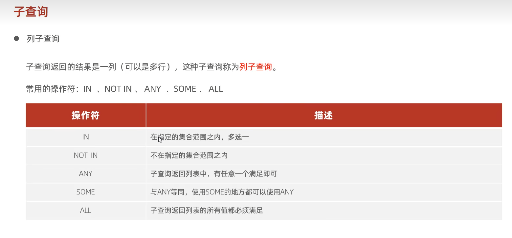

## 子查询
* 标量子查询
* 列子查询
* 行子查询
* 表子查询

### 1.标量子查询：
``` sql:
select 字段名列表 from 表名 where 字段名1 = (select 字段名1 from 表名);
```
### 2.列子查询：
``` sql:
select 字段名列表 from 表名 where colum1= (select colum1 from 表名);
```

### 3.行子查询：
如上；

### 4.表子查询：
```sql:
select 字段名列表 from (子表) as 别名;        
```
注意：
需要设置别名