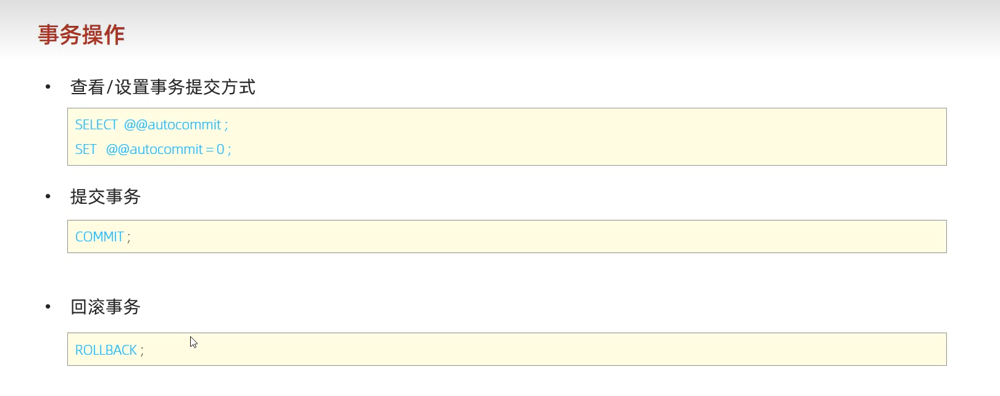
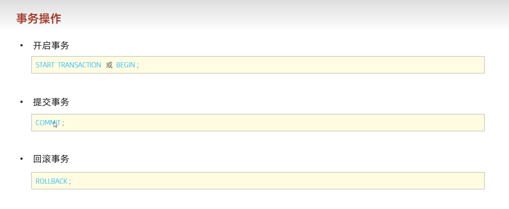
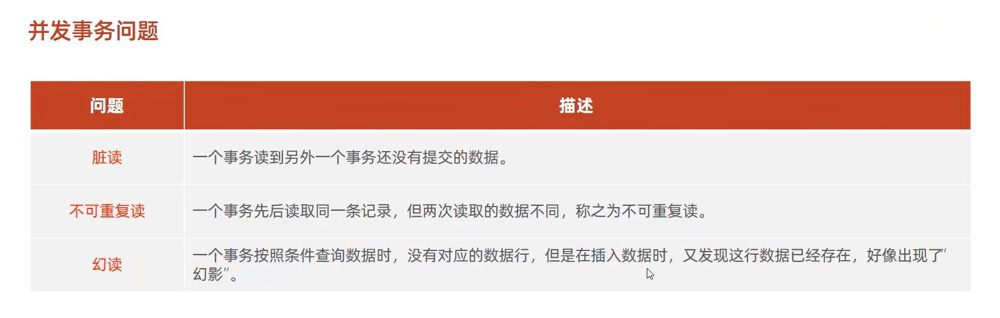

# 事务
## 1.事务概述
* 事务是指一段操作集合：
   类似顺序执行和物理串联。
   特点：全部执行，或者全部失败。
> 例如:银行转账业务，先查询账户余额，在进行转账，A处扣除a元，B处增加a元，但只要一处失败，就会停止操作并回滚操作
* 事务执行步骤：
1. 开启事务
2. 提交事务
3. 如果出错，回滚事务
* 事务操作：
> 方法一：
>    
---
> 方法二：
> 
---
* 事务特性：
  1. 原子性
  2. 一致性
  3. 隔离性
  4. 持久性
---
* 并发事务问题：
  1. 脏读
  2. 不可重复性
  3. 幻读
> 